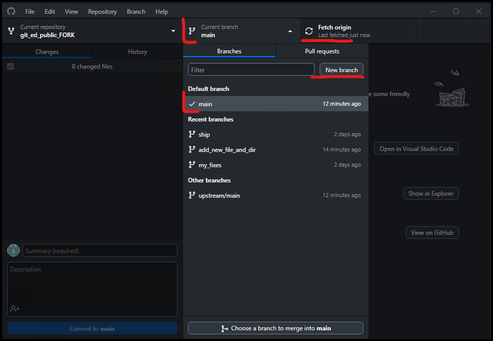
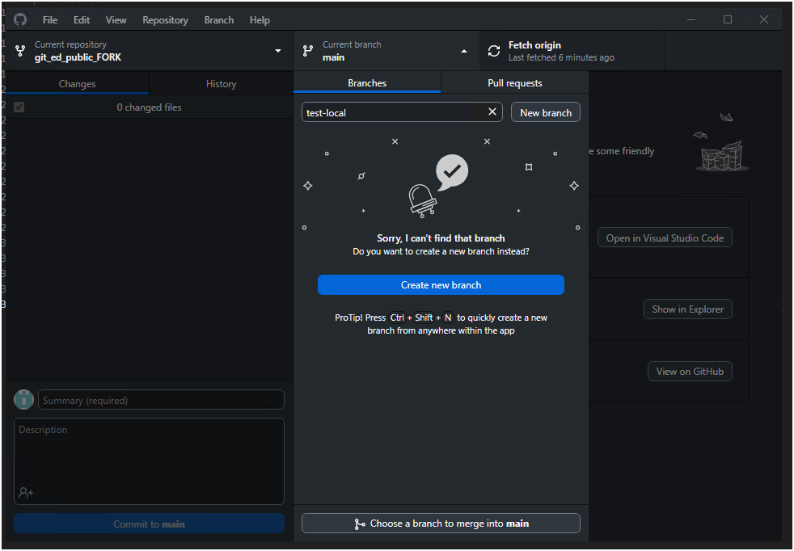
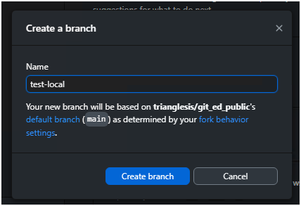
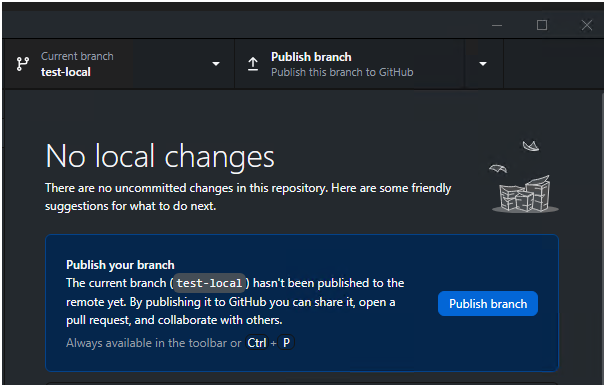
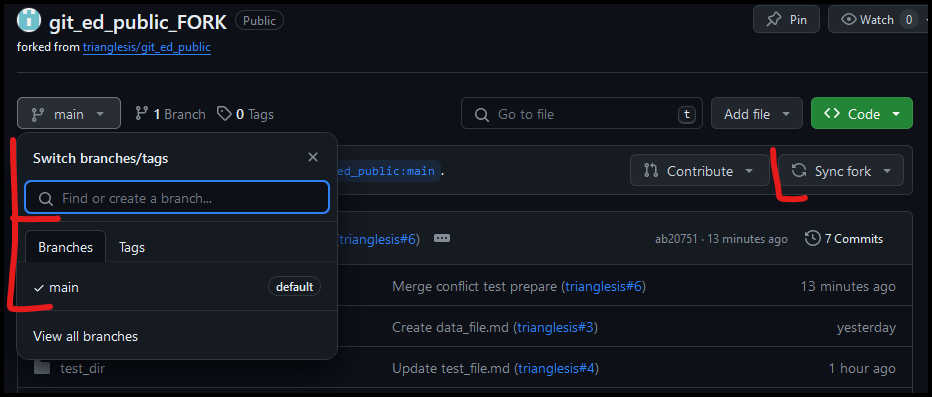
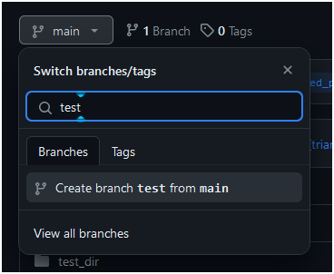
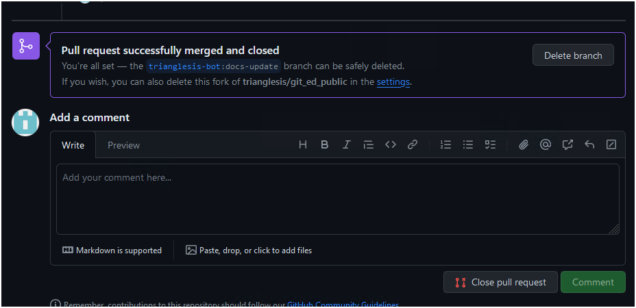

# Create a new branch

## In GitHub Desktop

1. Fetch origin - get all the latest changes
2. Check you are at the main now
3. Type a new name and hit the "New Branch" button.

### One

- Verify

### Two

- Name a new branch

### Three

- Check if everything is the same

### Four

- Publish your new branch to your fork repo

## At GitHub WEB

1. Sync your fork to have all the latest changes from the original repo
2. Go to the main branch dropdown menu
3. Name a new branch
4. Select "Create branch %**name**% from **main**.

### One

- Sync and name

### Two

- Create

### Three

- To have your branch appear in a local repo, use the "Fetch origin"

# Important

It's better to create new branches locally and then push them into your remote fork repository.

# Delete branch

It's pretty straightforward.

- Choose to delete at the GitHub web in "View all branches" under the branch dropdown menu.

- Choose to delete a branch at GitHub Desktop by clicking the right button of your mouse over the branch you want to delete.

- Delete the branch right at the Pull Request page, when your changes are approved.

