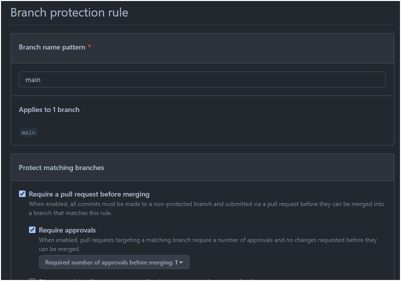
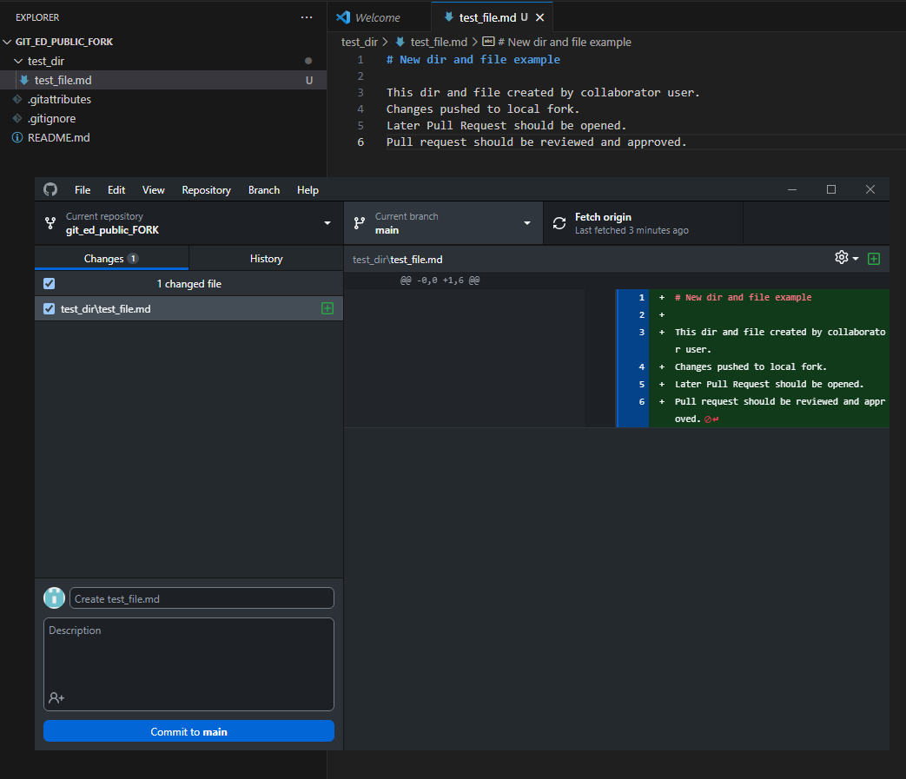
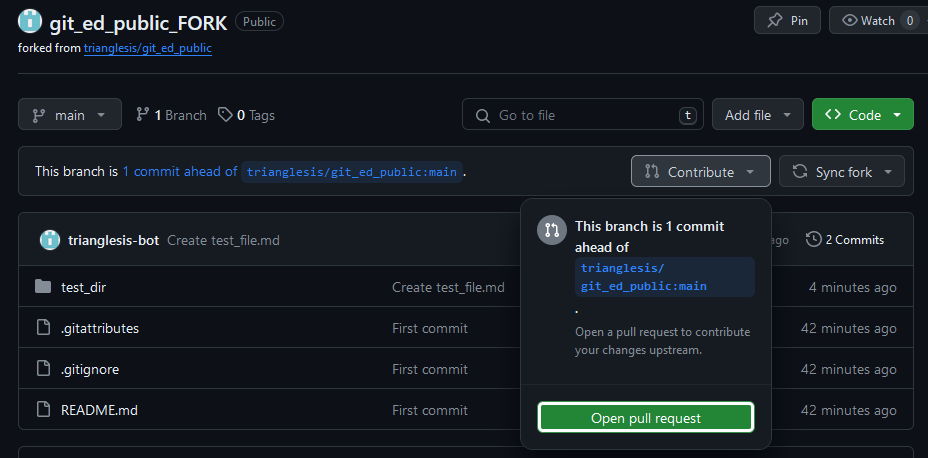
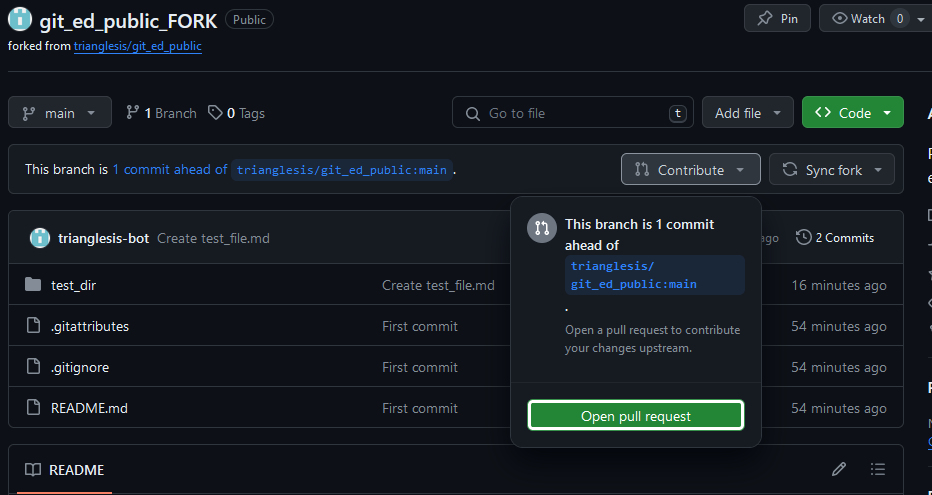

# Push your code in the forked repo

What is a fork: 
- Forking: [fork readme](DOCUMENTATION/forking/fork_original_repo.md) (prefered)

##  The main branch is protected

  - The main branch is protected
    - which means you only can create the **Pull Request** to push into this branch.
  - You should use **Fork** to contribute to the repo.
    - You can clone the original repo, but you cannot push your code directly into it.
  - Your request should be approved before your code appears in the original repository
  - All your changes are saved in your fork repository

How it looks like:

- 

### Pushing into

- You are pushing your changes to the fork, not the original repo
- You should create a **Pull Request** later after you push the code into your fork
- Your code will appear in the project repo only after PR (**pull request**) is approved by someone

#### You changed something and now are ready to commit + push

This is what it looks like:

- 
  - You can add the main subject (short one-liner) and description with a better explanation
  - You can add co-authors
  - You can uncheck files you don't want to commit now, or you want to commit in different "changes".

More info on committing locally: [commit your changes to save local history](working_with_repo_locally.md)

Push "**commit to main**", it makes a history of your changes, locally, and now "**Push origin**" to upload them to your online fork (repo)

Now your fork has a new commit and it shows the difference with the original repo:

And now you can contribute to the original repository:

1. Web
   - Create a new Pull Request 
     - 
   - More about PR and Reviwev: [PR and review](../pull_request/pull_request_and_review.md)
