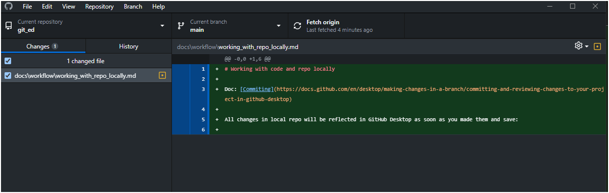

# Working with code and repo locally

Doc: 
 - [Committing](https://docs.github.com/en/desktop/making-changes-in-a-branch/committing-and-reviewing-changes-to-your-project-in-github-desktop)

All changes in the local repo will be reflected in GitHub Desktop as soon as you make them and save them:

You need to decide what approach is better for you:

1. Committing all changes periodically to the local git repo and later squash and push as one big change.
2. Commit only when you are ready and you've made all changes.
3. Create a separate branch for all your changes locally, and later squash and merge to the main branch (local)

TODO: We need to decide.