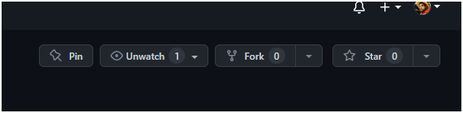
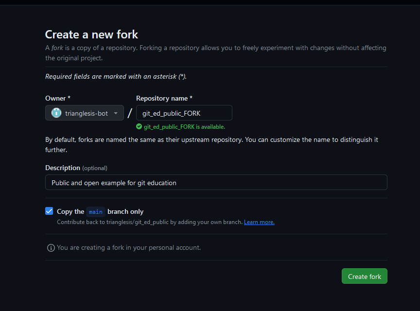
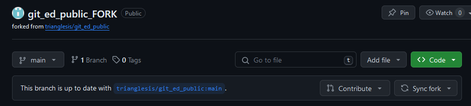
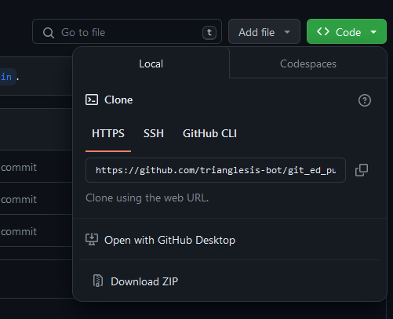
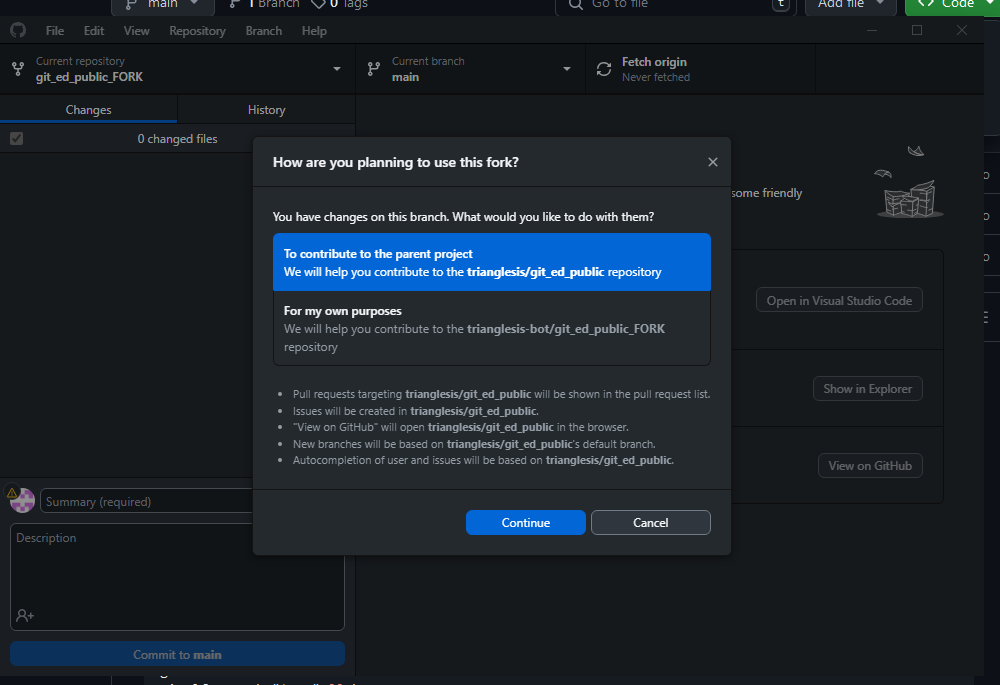
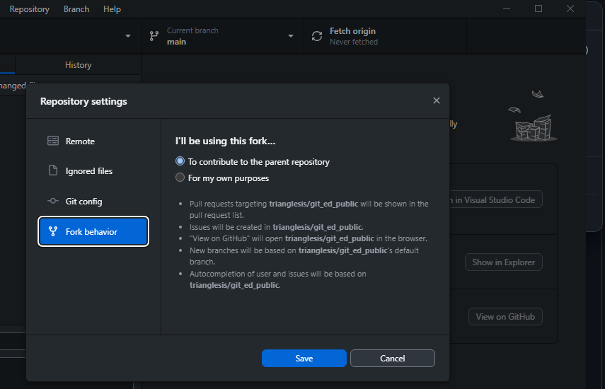
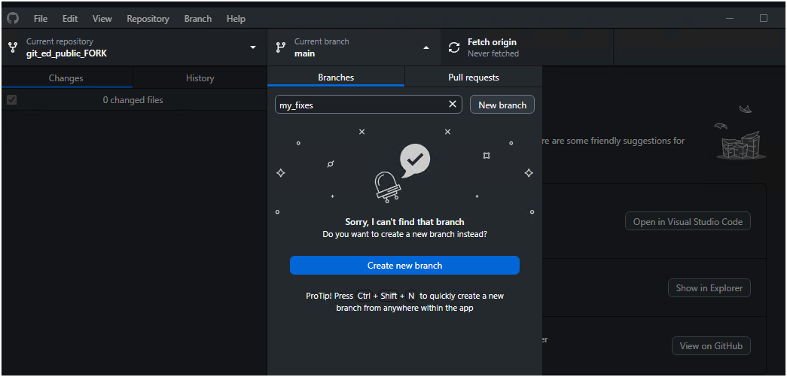

# How to fork

1. [Install GitHub Desktop client first](working_with_github_desktop.md)

2. Make a fork of the original repository at the WEB page of the desired repo:
   - 

3. Name it and set it as you wish:
   - 
   - Probably you need the main branch only.

4. Do not forget to sync the latest changes from the original repository to your fork!
    - How to [Sync fork](https://docs.github.com/en/pull-requests/collaborating-with-pull-requests/working-with-forks/syncing-a-fork)
      - 

### Pulling your fork from GitHub:

  - The easiest way from WEB, open with GH Desktop
    - 
  
  - At the first initialization choose "To contribute"
    - 
  
  - To check this later, go to GH Desktop -> Repository -> Settings
    - 
  
  - Open this repo in any editor you prefer, **VS Code is ok**

  - DO NOT USE the **main** branch of your fork for any changes!
    - [Explanation1](https://stackoverflow.com/a/29049698)
    - [Explanation2](https://stackoverflow.com/a/14681796)
      - If you changed (commit code at) your main branch at the forked repository, you would probably need to start over.

  - Create a new branch for your work
    - You can and probably should create a new branch for each significant change or fix you do with patterns or tests.
    - 

All changes you made in the fork are only live at the fork, later you need to create a pull request to push your changes into the original repository.

## Your workflow

1. Sync the latest changes from the original repo **main** branch to your fork **main** branch.
2. Create a new branch for a particular fix, and commit to this new branch as long as you need.
3. When ready - you need to create a Pull Request from your fork -> **new_branch** to a **main** branch of the original repo.
4. When the **Pull Request** is approved at the original repo - you need to **Squash** your commits in one and **merge code** into the original repo main branch.
5. Sync the latest changes from the main branch of the original repo to your fork main branch again, if needed.

## What is a fork:

1. Read this:
   - What is [fork](https://docs.github.com/en/pull-requests/collaborating-with-pull-requests/working-with-forks/fork-a-repo)
   - [Clone VS Fork](https://github.com/orgs/community/discussions/35849)
   - [Another explanation](https://stackoverflow.com/a/34343080)

## Why fork

1. Each user has its own sandbox playground.
2. Teams also can use forking.
3. Each user decides how and when to sync changes from the main repo.
4. All conflicts stay at the local fork, and not at the original repo.
5. We can ask users to squash commits at logical chunks, one commit = one case, so there will be no changes with a "fast test fix" after the initial change.
6. Users can create as many local branches as they wish to separate work on different features, and bugs.
7. Fork only supports Pull Request to the original repo, so it automatically raises a review process.
8. Enforced linear history
9. Octopus can assign reviewers automatically
10. Main to Ship merging will be much easier and cleaner

## Problems for Octopus
- I'm not sure yet how to automate fork tests at the user level on Octopus
- Probably I need to make tests only after initial approval when a person makes a Pull Request and the code goes to the main branch
- In such cases, people only test their code themselves at the local fork, then push code at the original repo main branch, and only after that, Octopus can run tests
- I need to understand, at what stage CORE reviewers will be bothered, at the first pull request or only when main-to-ship meging?