# Review process in GitHub

**Pull Requests** in Git Hub include not only approval from maintainers and responsible persons but also include a code review.

## With **Pull Request** functionality:

- You can see your changes before and push **Create**
- You can see your fork of the main branch will contribute to the main branch of the original repo, clean and simple
- You can create multiple branches in your fork
  - each branch can have changes for separate cases, bugs, features
  - each branch can contribute to the original repo under a separate **Pull Request**

- This example shows a primitive contribution, when you only have a FORK from the main branch of the original repo, you've made changes in your repo and branch main, and now pushing those changes to the original repo.

  - 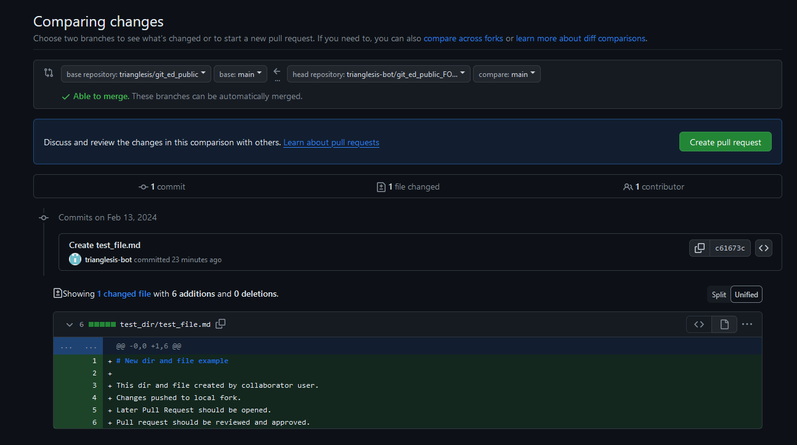

## Pull Request

General view:

  - 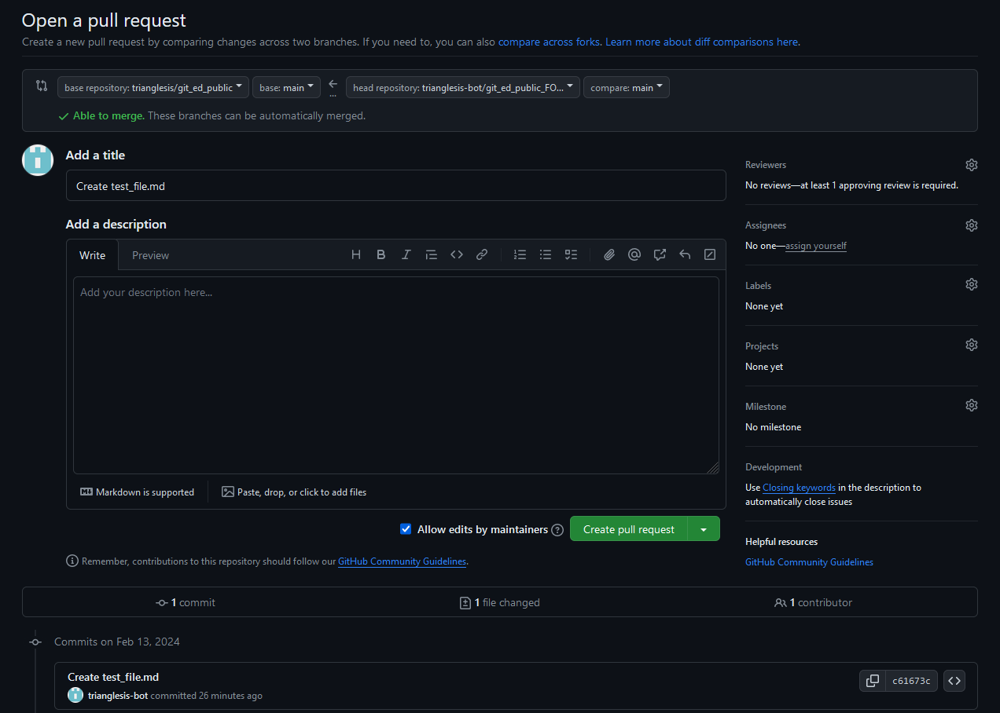

- Title and description
  - Add here one line of explanation as a subject and a multiline description to add more context.
- Reviewers
  - People who can review your code, leave comments or approve your change
  - Octopus can assign reviewers automatically balancing reviews between all team members and it can also have different groups of reviewers: TKU, CORE, etc.
- Assignees: usually it's you.
    - But you can add somebody else who can finish this request if you are out of work.

## View from a collaborator perspective

As a collaborator, you can assign reviewers, and assignees, leave comments and merge the code if it was approved.

- 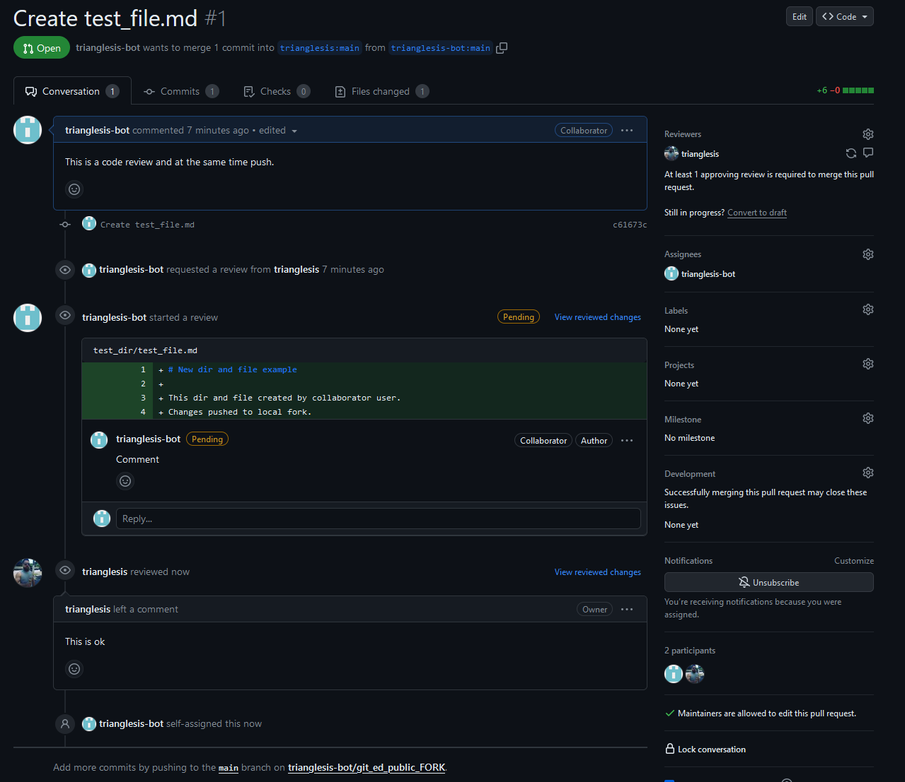

As a contributor, you can add comments, but do not forget to "Submit review" after you are ready to publish your comments! Otherwise, your comments will not be visible to other people!

- 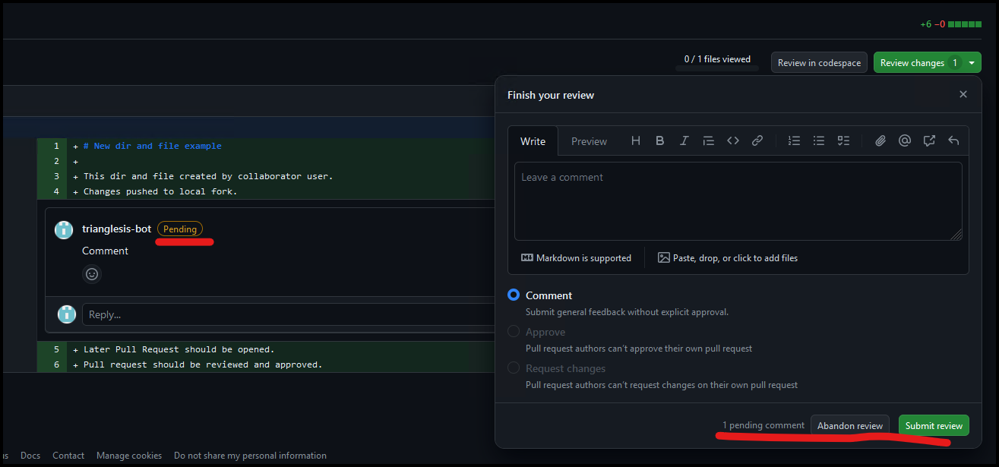

Here reviewer asked to add one line:

- 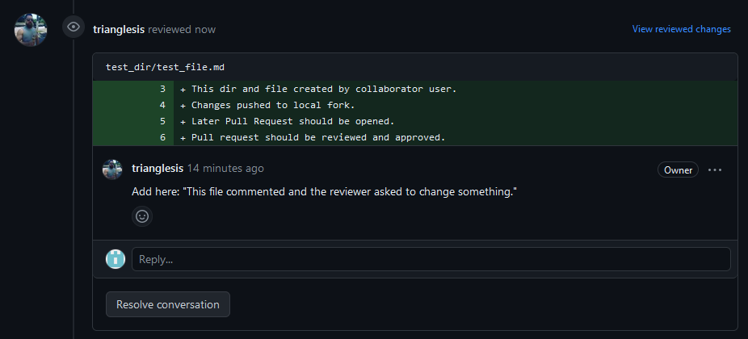

You can answer and resolve the conversation:

- 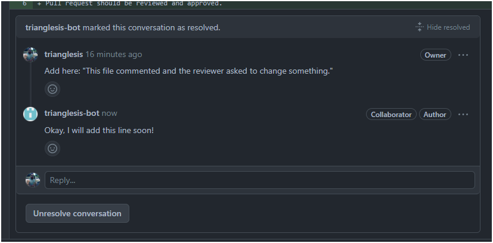

## View from a reviewer's perspective

As a reviewer, you can leave comments, ask for additional changes or approve. 

- 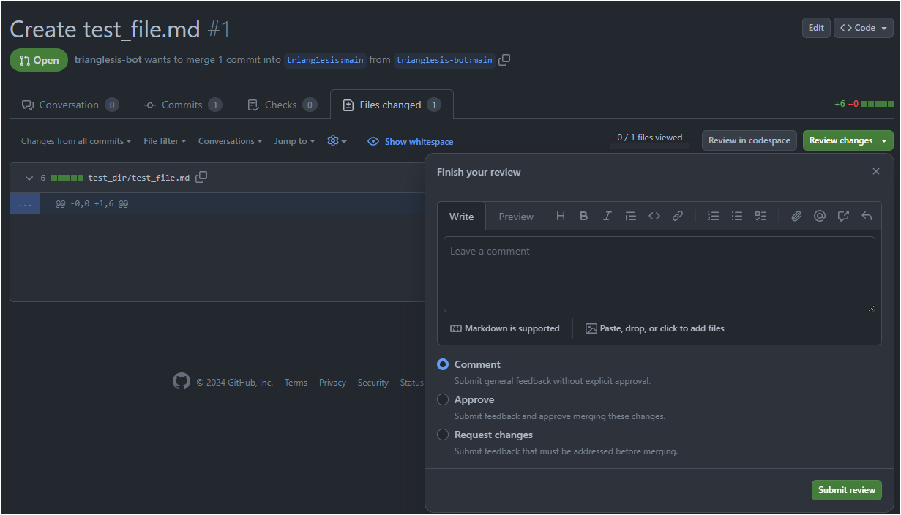

- 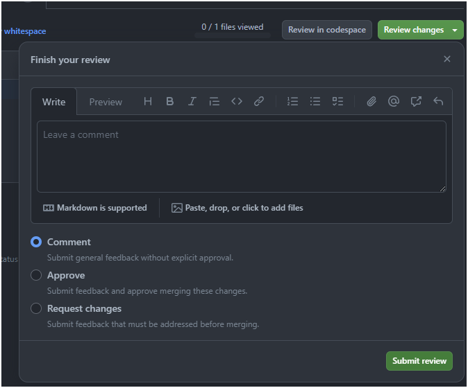

As a reviewer, you can add comments, but do not forget to "Submit review" after you are ready to publish your comments! Otherwise, your comments will not be visible to other people!

- 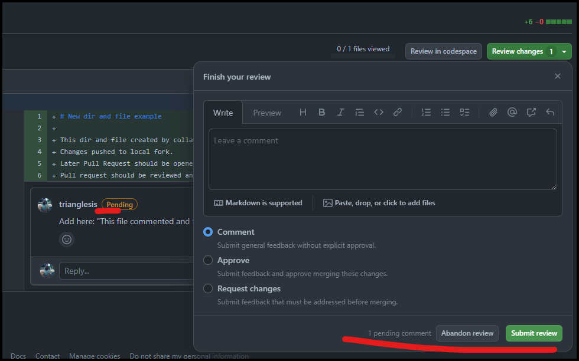

Here reviewer asked to add one line:

- 

We have a plan to automate testing the code before merging. But it requires a stable workflow, so we can use the same approach for all.

## Fixing code after comments and pushing it again:

As a contributor you've made changes and are ready to push new code into existed Pull Request:

- 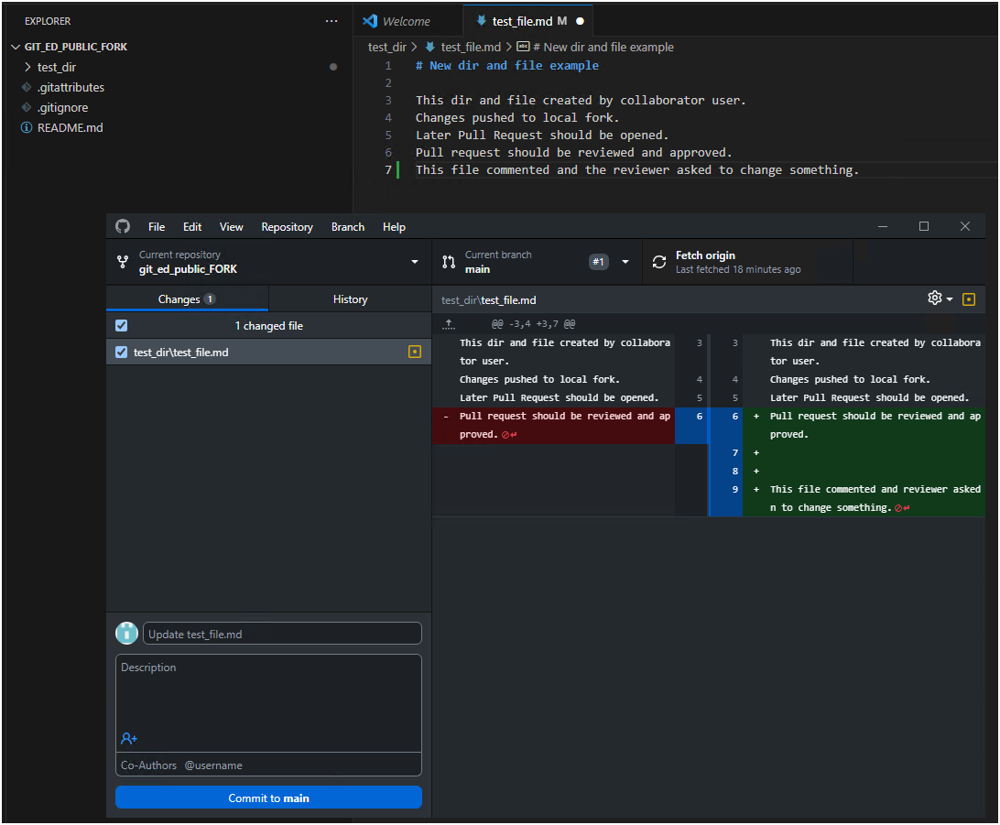

Commit the changed code with the fix to your fork and push it to your remote repo.
All your changes should soon appear in the previously opened **Pull Request** automatically.

- 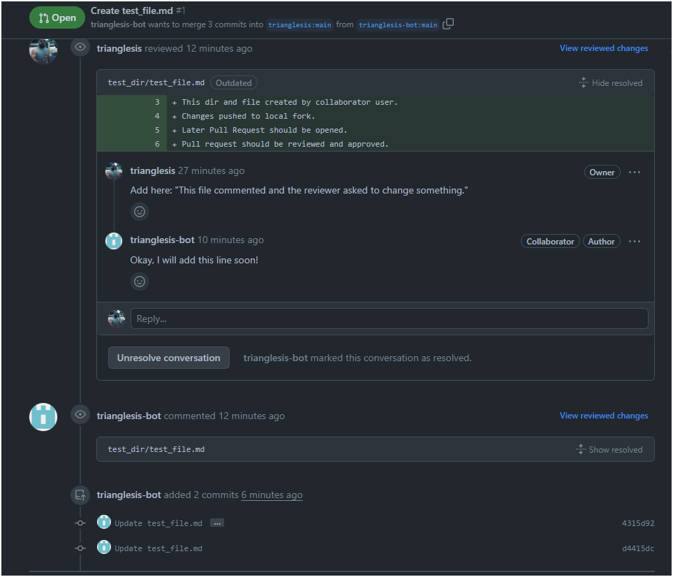

### More pictures for the same process:

- Add new comment as reviewer 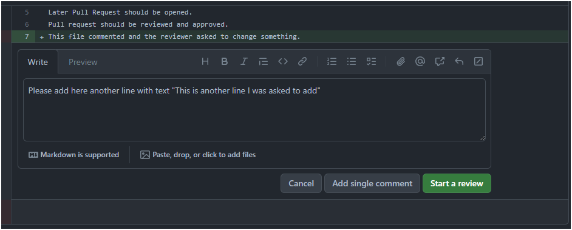
- Do not forget to submit a review: 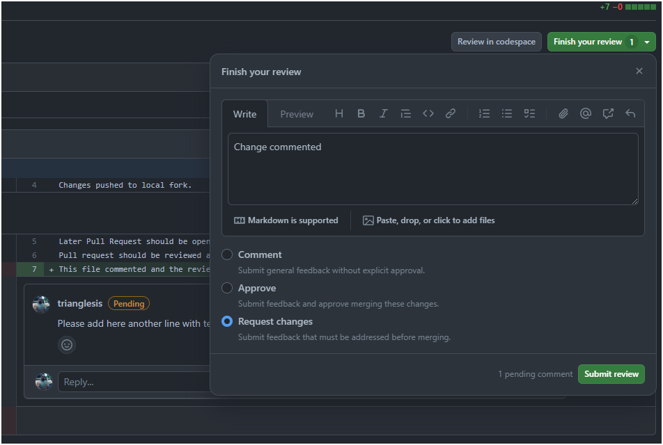
- Best practice: comment on the line you want to be changed, and additionally comment on the review: 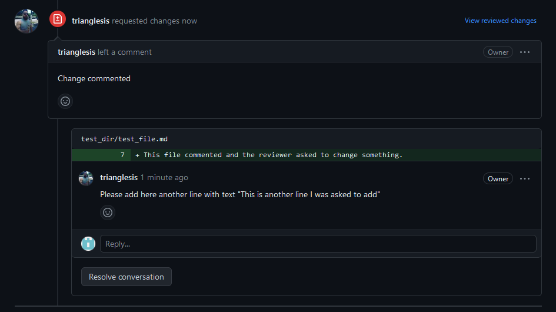

## Now the reviewer is happy and can approve

Let's see the whole work done at one PR:

- There are a few commits in this PR 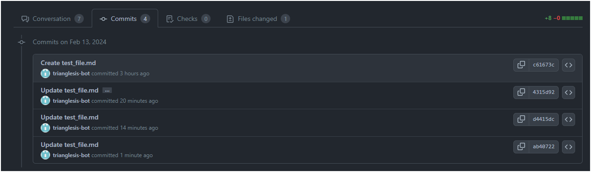

Later we need to squash all commits to a ONE single commit, so our original main branch will only have ONE commit in history.

Now reviewer only approves this PR:

Go to the **Files Changed** tab:

- Select **Approve**: 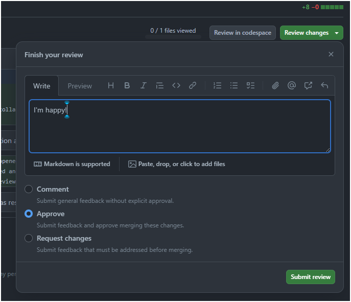

### Approved:

Now user can merge his code onto the original main branch. Also, reviewers can do this, and assignees can too.

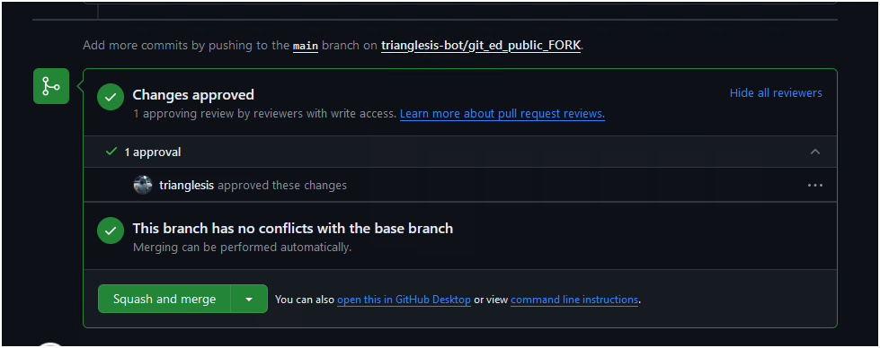

## Merging

See [Merge PR](merge_pull_request.md)

## Tests

Automated tests can be added by GitHub actions and deployments.

  - 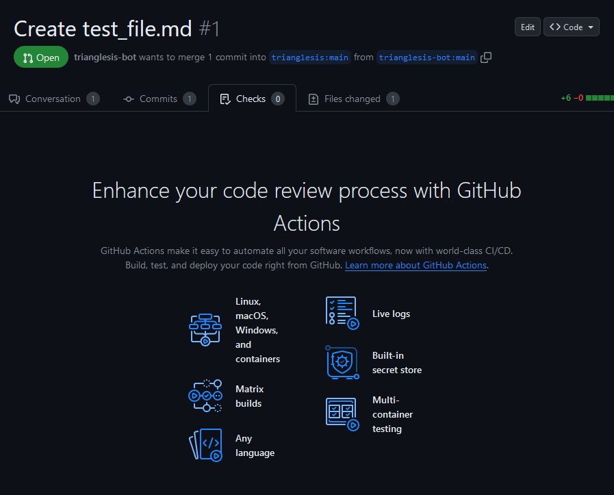

Some functionality is blocked at GihHuib BMC, we need to insist on using this part of GitHub.
