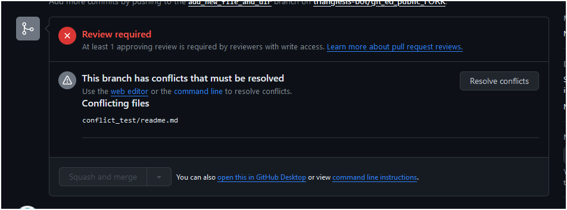
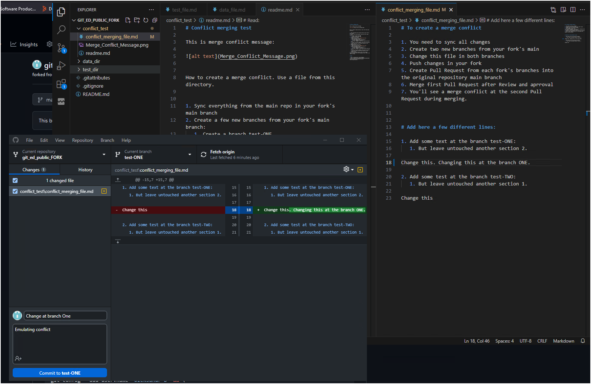
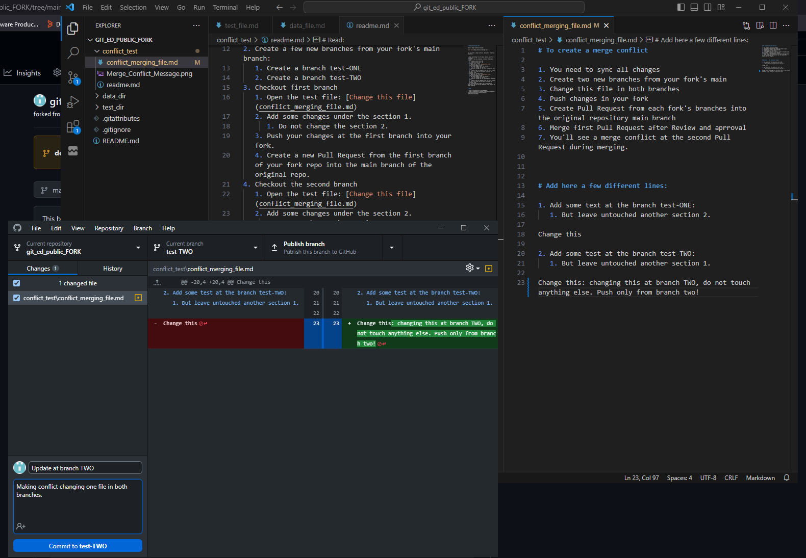
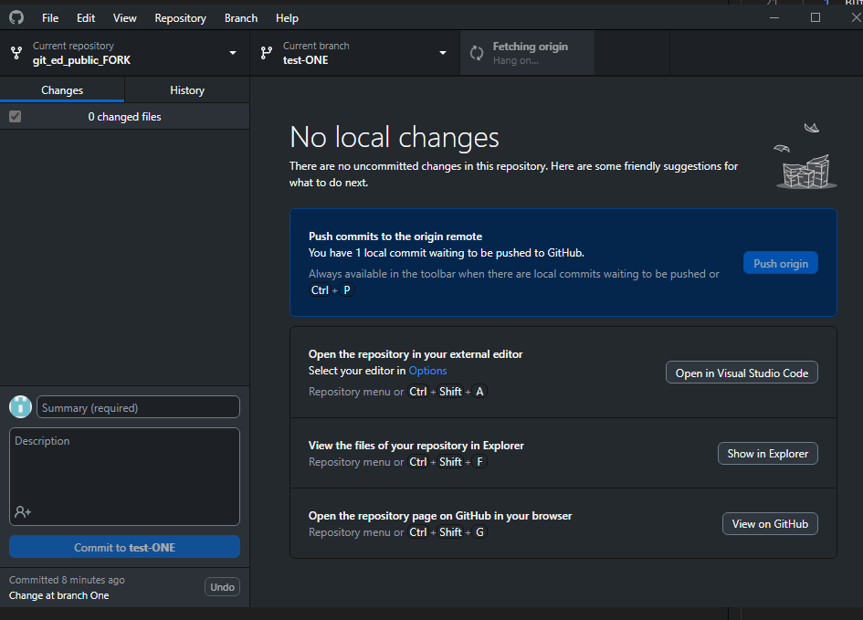
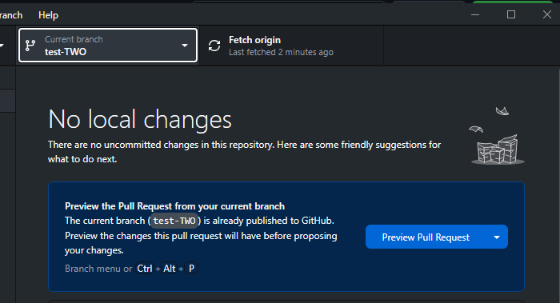

# Conflict merging test

This is merge conflict message:

How to create a merge conflict. Use a file from this directory. 

1. Sync everything from the main repo in your fork's main branch
2. Create a few new branches from your fork's main branch:
   1. Create a branch test-ONE
   2. Create a branch test-TWO
3. Checkout first branch
   1. Open the test file: [Change this file](conflict_merging_file.md)
   2. Add some changes under the section 1.
      1. Do not change the section 2.
   3. Push your changes at the first branch into your fork.
   4. Create a new Pull Request from the first branch of your fork repo into the main branch of the original repo.
4. Checkout the second branch
   1. Open the test file: [Change this file](conflict_merging_file.md)
   2. Add some changes under the section 2.
      1. Do not change the section 2.
   3. Push your changes at the second branch into your fork.
   4. Create a new Pull Request from the first branch of your fork repo into the main branch of the original repo.
5. If everything done right, you'll see a merge conflict at the one of Pull Requests after they'll be ready to Merge.

# Pics

- Change in the branch one

- Change in the branch TWO

- Push your changes

- Pull request

# Read:

- https://stackoverflow.com/a/45386813
- https://codeforphilly.github.io/decentralized-data/tutorials/actually-using-git/lessons/conflicting-branches/
